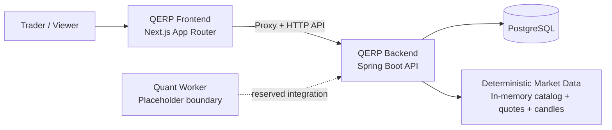
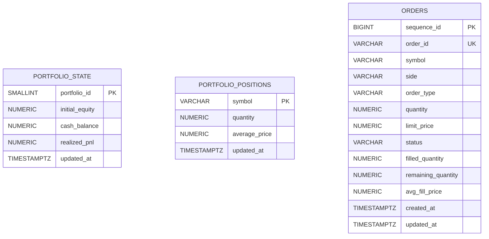

# QERP

QERP is a paper-trading web application foundation built around a simple, deployable vertical slice: market lookup, deterministic market snapshots, paper order simulation, and portfolio tracking in a single web dashboard.

The current implementation is intentionally narrow and honest. It combines a **Next.js App Router frontend**, a **Spring Boot 3 / Java 21 backend**, **PostgreSQL + Flyway** persistence, and a **placeholder quant-worker boundary** for future automation.

## Product Overview

QERP is aimed at the paper-trading experience first:
- discover a supported instrument
- inspect a quote snapshot
- view a deterministic candle chart
- place a paper order
- see the portfolio and positions update through the backend source of truth

Today, the product is best understood as a polished foundation for a deployable paper-trading web app rather than a full brokerage platform.

## Current Capabilities

### Implemented now
- Paper order API for **create / get / list / cancel**
- Portfolio **summary** and **positions** views
- Instrument search across the built-in market catalog
- Quote snapshot endpoint for supported symbols
- Deterministic daily candle series for chart rendering
- Next.js dashboard with:
  - instrument search
  - quote panel
  - candle chart panel
  - order entry form
  - portfolio summary
  - positions table
  - recent orders list
- PostgreSQL-backed persistence for orders and portfolio state
- Flyway-managed schema creation

### Not yet implemented
- Authentication and user accounts
- Real broker connectivity or live order routing
- Multi-user portfolio isolation
- Live streaming market data
- Automated quant strategies or worker-driven signals

## Public Product Surface

### Web surface
- A single dashboard route at `/` in the Next.js app
- Dashboard panels for instrument search, quote snapshot, candle chart, paper order entry, portfolio summary, positions, and recent orders
- A frontend proxy route at `/api/backend/*` so the browser does not call the backend service directly

### Backend API surface

| Route group | Current public behavior |
| --- | --- |
| `GET /api/v1/instruments/search?q=...` | Search the built-in supported instrument catalog |
| `GET /api/v1/market/quotes/{symbol}` | Return a deterministic quote snapshot for a supported symbol |
| `GET /api/v1/market/candles/{symbol}?interval=1D&limit=30` | Return deterministic daily candles for a supported symbol |
| `GET /api/v1/portfolio` | Return paper portfolio headline metrics |
| `GET /api/v1/portfolio/positions` | Return current open positions |
| `POST /api/v1/orders` / `GET /api/v1/orders` / `GET /api/v1/orders/{orderId}` / `POST /api/v1/orders/{orderId}/cancel` | Create, inspect, list, and cancel paper orders |

### Demo market-data scope
- A built-in seven-symbol US equity demo catalog
- Deterministic quote snapshots rather than a live feed
- Daily candle series with `1D` interval support and a maximum of 60 returned sessions per request

## Architecture Snapshot

| Layer | Technology | Current responsibility |
| --- | --- | --- |
| Frontend | Next.js App Router, TypeScript, React | Web dashboard, backend proxy route, client-side data loading and rendering |
| Backend | Spring Boot 3, Java 21, Gradle | REST API, paper order simulation, portfolio calculation, market-data access |
| Database | PostgreSQL, Flyway | Persistent order records and portfolio state |
| Quant worker | Python placeholder | Reserved integration boundary; no active runtime logic yet |

## System Context



## Runtime Lifecycle Summary

1. **Dashboard load**  
   The frontend loads portfolio summary, positions, and recent orders through its backend proxy route.
2. **Instrument lookup**  
   A user searches the built-in instrument catalog, then the frontend requests a quote snapshot and candle series for the selected symbol.
3. **Order submission**  
   The backend validates the request, pulls the current deterministic reference price, simulates the paper execution, persists the order, and updates portfolio state in PostgreSQL.
4. **Portfolio refresh**  
   The frontend reloads portfolio and order data so the new state is immediately visible.
5. **Order cancellation**  
   Pending orders can be cancelled through the API; the backend validates status and updates the persisted order record.

**Current execution model:** market orders fill immediately, and limit orders are evaluated once at submission time against the current reference price. If a limit order does not cross at submission, it remains `PENDING` until cancelled; a background re-pricing engine is not implemented yet.

More detail: [docs/runtime-lifecycle.md](docs/runtime-lifecycle.md)

## Core Domain / ERD Overview

The current persisted domain is intentionally small:
- `orders` stores the paper-trading order lifecycle
- `portfolio_state` stores the shared paper account headline state
- `portfolio_positions` stores symbol-level holdings



Notes:
- The runtime currently operates a **single shared paper portfolio**.
- `portfolio_state` and `portfolio_positions` are updated together by backend transaction logic, but the current schema does **not** persist a foreign-key relationship between them.
- Orders affect portfolio state through backend service logic rather than direct SQL foreign keys.
- Market data used for quotes and charts is currently served from a **small built-in demo catalog** in application memory, not stored in database tables.

More detail: [docs/erd.md](docs/erd.md)

## Repository Structure

```text
qerp3/
├─ backend/        Spring Boot API, domain logic, JDBC persistence, Flyway migrations
├─ frontend/       Next.js App Router dashboard and backend proxy route
├─ quant-worker/   Placeholder Python worker boundary for future automation
├─ infra/          Infrastructure placeholder and deployment-facing assets
├─ docs/           Public architecture, lifecycle, and domain documentation
└─ README.md
```

### Program structure at a glance

**Backend**
- `api/` - REST controllers and response models
- `application/` - orchestration, services, persistence adapters, market-data service
- `domain/` - paper trading and portfolio domain rules
- `src/main/resources/db/migration/` - Flyway schema migrations

**Frontend**
- `src/app/` - App Router entrypoints and proxy route
- `src/components/` - dashboard UI panels
- `src/lib/` - API client and request helpers
- `src/types/` - shared frontend API types

More detail: [docs/architecture.md](docs/architecture.md)

## Local Run / Test Basics

### Prerequisites
- Java 21
- PostgreSQL
- Node.js 20+

### Backend

```bash
cd backend
export QERP_DB_URL=jdbc:postgresql://localhost:5432/qerp
export QERP_DB_USERNAME=qerp
export QERP_DB_PASSWORD=qerp
./gradlew bootRun
```

Flyway creates the current schema on startup.

### Frontend

```bash
cd frontend
cp .env.example .env.local
npm install
npm run dev
```

By default, the frontend targets `http://localhost:8080` and forwards browser requests through `/api/backend/...`.

### Tests

```bash
cd backend
./gradlew test
```

```bash
cd frontend
npm test
```

## Public-Facing Docs

- [Architecture](docs/architecture.md)
- [Runtime lifecycle](docs/runtime-lifecycle.md)
- [Core ERD](docs/erd.md)
- [Current product scope](docs/mvp.md)

## Not Implemented Today

QERP is currently focused on a clean paper-trading foundation. The next broad product layers that are **not implemented yet** are:
- authentication and portfolio ownership
- richer market-data connectivity
- real brokerage integration
- quant-worker automation beyond the placeholder boundary
- production-grade deployment and observability hardening

Those areas are intentionally left out of the current product slice.
