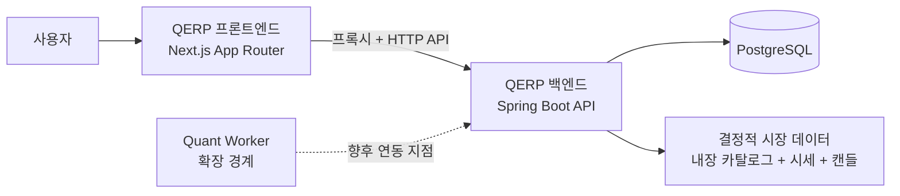
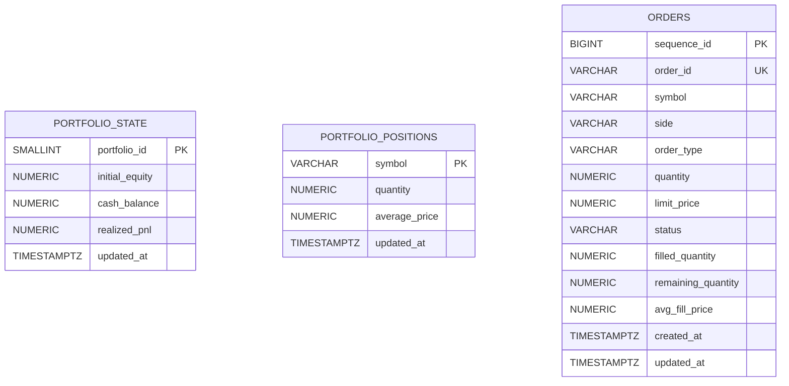

# QERP

QERP는 메인 대시보드와 선택 심볼 상세 화면을 오가며 종목 탐색, 시세 확인, 차트 조회, 페이퍼 주문, 포트폴리오 추적까지 이어지는 흐름을 제공하는 *페이퍼 트레이딩 웹 애플리케이션 기반 프로젝트*입니다.

현재 구현 범위는 의도적으로 좁고 분명합니다. **Next.js App Router 프론트엔드**, **Spring Boot 3 / Java 21 백엔드**, **PostgreSQL + Flyway 기반 영속성**, 그리고 향후 확장을 위한 **quant-worker 경계**를 조합해 실제로 실행 가능한 세로 슬라이스를 구성합니다.

## 제품 개요

QERP는 우선 페이퍼 트레이딩 경험 자체를 깔끔하게 제공하는 데 초점을 둡니다.
- 지원 종목 검색
- 현재가 스냅샷 확인
- 결정적 일봉 차트 조회
- 페이퍼 주문 제출
- 백엔드를 기준으로 갱신되는 포트폴리오와 포지션 확인

지금의 QERP는 완전한 증권 플랫폼이라기보다, 배포 가능한 페이퍼 트레이딩 웹 앱의 기반을 정리해 둔 제품형 프로젝트에 가깝습니다.

## 현재 제공 기능

### 이미 구현된 기능
- 페이퍼 주문 API: **생성 / 단건 조회 / 목록 조회 / 취소**
- 포트폴리오 **요약** 및 **포지션** 조회
- 내장 종목 카탈로그 기반 종목 검색
- 지원 심볼 대상 시세 스냅샷 조회
- 차트 렌더링용 결정적 일봉 캔들 데이터 조회
- quant-worker 플레이스홀더 CLI: 결정적 `BUY` / `HOLD` / `SELL` 신호와 짧은 설명 JSON 반환
- 백엔드 quant signal API: 시세 컨텍스트를 바탕으로 quant-worker CLI를 동기 호출해 현재 신호 JSON 반환
- Next.js 대시보드 UI
  - 종목 검색
  - 시세 패널
  - 캔들 차트 패널
  - 주문 입력 폼
  - 포트폴리오 요약
  - 포지션 테이블
  - 최근 주문 목록
- PostgreSQL 기반 주문/포트폴리오 상태 저장
- Flyway 기반 스키마 생성 및 관리

### 아직 구현되지 않은 기능
- 인증 및 사용자 계정
- 실제 브로커 연동 또는 실주문 라우팅
- 사용자별 포트폴리오 분리
- 실시간 스트리밍 시세
- 자동화된 퀀트 전략 실행, 스케줄링, 비동기 워커 처리

## 공개 제품 표면

### 웹 화면
- Next.js 앱의 단일 대시보드 경로 `/`
- 선택 종목의 전용 상세 경로 `/instruments/[symbol]`
- 검색 결과의 `Open detail`, 포지션 심볼 링크, 최근 주문 심볼 링크가 모두 같은 상세 경로로 딥링크됩니다.
- 상세 화면에서는 같은 심볼이 시세, 차트, quant signal, 주문 패널의 공통 기준 상태가 됩니다.
- 종목 검색, 시세/차트/quant/주문 상세 흐름, 포트폴리오 요약, 포지션, 최근 주문 패널
- 브라우저가 백엔드를 직접 호출하지 않도록 하는 프론트엔드 프록시 경로 `/api/backend/*`

### 백엔드 API

| 경로 그룹 | 현재 공개 동작 |
| --- | --- |
| `GET /api/v1/instruments/search?q=...` | 내장 지원 종목 카탈로그를 검색합니다. |
| `GET /api/v1/instruments/{symbol}` | 선택 심볼의 기준 메타데이터를 반환합니다. |
| `GET /api/v1/market/quotes/{symbol}` | 지원 심볼의 결정적 시세 스냅샷을 반환합니다. |
| `GET /api/v1/market/candles/{symbol}?interval=1D&limit=30` | 지원 심볼의 결정적 일봉 캔들 데이터를 반환합니다. |
| `GET /api/v1/quant/signals/{symbol}` | 최신 시세와 기준가 컨텍스트를 바탕으로 quant-worker 플레이스홀더 신호를 반환합니다. |
| `GET /api/v1/portfolio` | 페이퍼 포트폴리오의 핵심 요약 지표를 반환합니다. |
| `GET /api/v1/portfolio/positions` | 현재 보유 중인 포지션 목록을 반환합니다. |
| `POST /api/v1/orders` / `GET /api/v1/orders` / `GET /api/v1/orders/{orderId}` / `POST /api/v1/orders/{orderId}/cancel` | 페이퍼 주문 생성, 조회, 목록 확인, 취소를 제공합니다. |

### 데모 시장 데이터 범위
- 미국 주식 7개 심볼로 구성된 내장 데모 카탈로그
- 실시간 피드 대신 결정적 시세 스냅샷 제공
- `1D` 간격만 지원하는 일봉 캔들 데이터
- 캔들 조회는 요청당 최대 60개 세션 반환

## 아키텍처 요약

| 계층 | 기술 | 현재 역할 |
| --- | --- | --- |
| 프론트엔드 | Next.js App Router, TypeScript, React | 대시보드 UI, 백엔드 프록시, 클라이언트 데이터 로딩/렌더링 |
| 백엔드 | Spring Boot 3, Java 21, Gradle | REST API, 주문 시뮬레이션, 포트폴리오 계산, 시장 데이터 접근 |
| 데이터베이스 | PostgreSQL, Flyway | 주문 기록과 포트폴리오 상태 저장 |
| Quant worker | Python 플레이스홀더 | 로컬 CLI와 테스트 가능한 신호 계약 제공, 백엔드가 온디맨드 quant signal 요청 시 동기 호출 |

## 시스템 컨텍스트



## 런타임 흐름 요약

1. **대시보드 진입**
   프론트엔드는 자체 프록시 경로를 통해 포트폴리오 요약, 포지션, 최근 주문을 불러옵니다.
2. **종목 탐색**
   사용자가 내장 종목 카탈로그를 검색하고, 선택한 심볼을 대시보드에 바로 로드하거나 `/instruments/[symbol]` 상세 경로로 이동합니다. 포지션과 최근 주문에서도 같은 심볼 상세 경로로 다시 진입할 수 있습니다.
3. **선택 심볼 상세 상태 고정**
   상세 화면에서는 하나의 심볼 메타데이터를 먼저 확인한 뒤, 같은 심볼로 시세 스냅샷, 캔들, quant signal, 주문 입력 상태를 함께 고정합니다.
4. **주문 제출**
   백엔드는 요청을 검증하고 기준 가격을 조회한 뒤, 페이퍼 주문을 시뮬레이션하고 결과를 PostgreSQL에 저장합니다.
5. **포트폴리오 갱신**
   프론트엔드는 최신 포트폴리오와 주문 데이터를 다시 불러와 변경 사항을 즉시 보여줍니다.
6. **주문 취소**
   대기 중인 주문은 API를 통해 취소할 수 있으며, 백엔드는 상태를 검증한 뒤 저장된 주문 레코드를 갱신합니다.

**현재 체결 모델:** 시장가 주문은 즉시 전량 체결됩니다. 지정가 주문은 제출 시점 기준 가격으로 한 번만 평가되며, 가격 조건을 만족하지 않으면 `PENDING` 상태로 남아 취소 전까지 유지됩니다. 제출 이후 가격 변화에 따라 재평가하는 백그라운드 엔진은 아직 구현되어 있지 않습니다.

자세한 내용: [docs/runtime-lifecycle.md](docs/runtime-lifecycle.md)

## 핵심 도메인 / ERD 개요

현재 영속화되는 핵심 도메인은 작게 유지되어 있습니다.
- `orders`: 페이퍼 주문의 전체 생명주기 저장
- `portfolio_state`: 공유 포트폴리오의 핵심 상태 저장
- `portfolio_positions`: 심볼별 보유 수량 저장



참고 사항:
- 현재 런타임은 **단일 공유 페이퍼 포트폴리오**를 사용합니다.
- `portfolio_state`와 `portfolio_positions`는 백엔드 트랜잭션 안에서 함께 갱신되지만, 스키마 차원 외래 키는 아직 없습니다.
- 주문이 포트폴리오 상태에 미치는 영향은 SQL 관계가 아니라 백엔드 서비스 로직으로 처리합니다.
- 시세와 차트에 쓰이는 시장 데이터는 현재 **애플리케이션 메모리의 소규모 데모 카탈로그**에서 제공되며 DB 테이블에 저장하지 않습니다.

자세한 내용: [docs/erd.md](docs/erd.md)

## 저장소 구조

```text
qerp3/
├─ backend/        Spring Boot API, 도메인 로직, JDBC 영속성, Flyway 마이그레이션
├─ frontend/       Next.js App Router 대시보드와 백엔드 프록시
├─ quant-worker/   향후 자동화를 위한 Python 워커 경계
├─ infra/          Docker Compose 운영 기준선과 배포 관련 문서
├─ docs/           공개용 아키텍처, 런타임, 도메인 문서
└─ README.md
```

### 코드 구조 한눈에 보기

**백엔드**
- `api/` - REST 컨트롤러와 응답 모델
- `application/` - 유스케이스 조합, 서비스, 영속성 어댑터, 시장 데이터 서비스
- `domain/` - 페이퍼 트레이딩과 포트폴리오 규칙
- `src/main/resources/db/migration/` - Flyway 스키마 마이그레이션

**프론트엔드**
- `src/app/` - App Router 진입점과 프록시 라우트
- `src/components/` - 대시보드 UI 패널
- `src/lib/` - API 클라이언트와 요청 도우미
- `src/types/` - 프론트엔드 공용 API 타입

자세한 내용: [docs/architecture.md](docs/architecture.md)

## 로컬 실행 및 테스트

### Docker Compose로 한번에 실행

```bash
cp .env.example .env
docker compose up --build
```

- 프론트엔드: `http://localhost:3000`
- 백엔드 API: `http://localhost:8080`
- PostgreSQL: `localhost:5432`
- 종료: `docker compose down`
- 데이터까지 초기화: `docker compose down -v`

포트와 DB 자격 증명은 루트 `.env`에서 조정할 수 있습니다. 자세한 사용법은 [infra/README.md](infra/README.md)를 참고하세요.

### 수동 실행 준비 사항
- Java 21
- PostgreSQL
- Node.js 20+
- Python 3.12+

### 백엔드 수동 실행

```bash
cd backend
export QERP_DB_URL=jdbc:postgresql://localhost:5432/qerp
export QERP_DB_USERNAME=qerp
export QERP_DB_PASSWORD=***
./gradlew bootRun
```

애플리케이션 시작 시 Flyway가 현재 스키마를 생성합니다.

### 프론트엔드 수동 실행

```bash
cd frontend
cp .env.example .env.local
npm install
npm run dev
```

기본 설정에서 프론트엔드는 `http://localhost:8080` 백엔드를 대상으로 하며, 브라우저 요청은 `/api/backend/...`를 통해 전달합니다. Quant 모드도 동일한 프록시 경로를 통해 `GET /api/v1/quant/signals/{symbol}` 백엔드 API를 사용합니다.

백엔드 quant signal API는 기본적으로 저장소 루트의 `quant-worker/`를 탐색해 `python3 -m app.main`을 실행합니다. 필요하면 아래 환경 변수로 로컬 경로를 덮어쓸 수 있습니다.

- `QERP3_QUANT_WORKER_DIR`: `quant-worker` 디렉터리 절대/상대 경로
- `QERP3_QUANT_PYTHON_BIN`: 워커 실행에 사용할 Python 바이너리 경로

### quant-worker 플레이스홀더 실행

```bash
cd quant-worker
python3 -m app.main \
  --symbol AAPL \
  --price 95 \
  --reference-price 100 \
  --threshold-percent 2 \
  --generated-at 2026-04-23T13:33:00Z \
  --pretty
```

이 명령은 기준가 대비 변동률만으로 `BUY`, `HOLD`, `SELL` 중 하나를 선택해 JSON으로 반환합니다. 자세한 계약은 [docs/quant-worker-contract.md](docs/quant-worker-contract.md)를 참고하세요.

### 테스트

```bash
cd backend
./gradlew test
```

```bash
cd frontend
npm test
```

```bash
cd quant-worker
python3 -m unittest discover -s tests -v
```

## 공개 문서

- [아키텍처](docs/architecture.md)
- [런타임 흐름](docs/runtime-lifecycle.md)
- [핵심 ERD](docs/erd.md)
- [현재 제품 범위](docs/mvp.md)
- [quant-worker 계약](docs/quant-worker-contract.md)

## 현재 미구현 범위

QERP는 현재 페이퍼 트레이딩 기반을 명확하게 제공하는 데 집중하고 있습니다. 아래 영역은 아직 구현되지 않았습니다.
- 인증 및 포트폴리오 소유권 관리
- 더 풍부한 시장 데이터 연동
- 실제 브로커 통합
- 플레이스홀더를 넘어서는 quant-worker 자동화
- 운영 배포 수준의 관측성 및 하드닝

이 영역들은 현재 공개 제품 범위에 의도적으로 포함하지 않았습니다.
