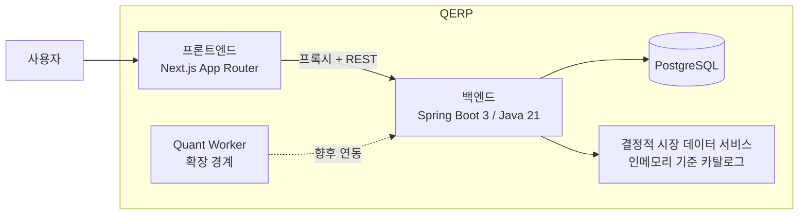
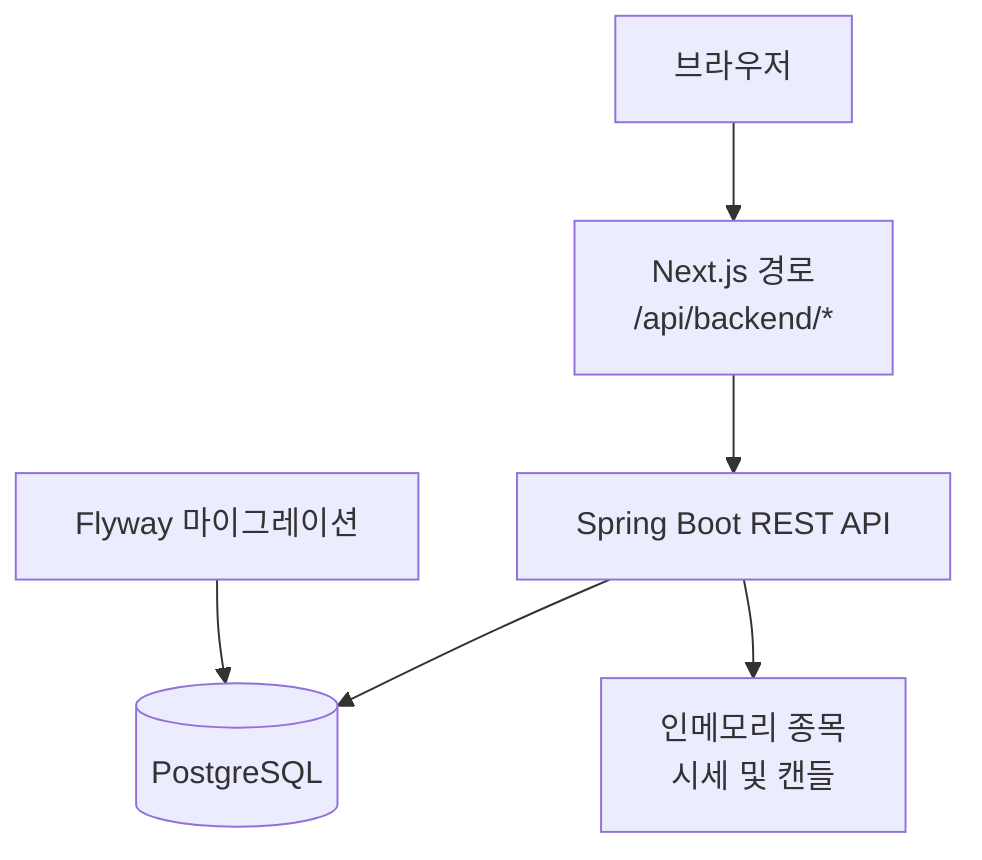

# QERP 아키텍처

## 개요

QERP는 현재 작고 분명한 경계를 가진 페이퍼 트레이딩 시스템으로 구성되어 있습니다.
- 제품 경험을 담당하는 **Next.js 웹 프론트엔드**
- 주문과 포트폴리오 상태의 기준이 되는 **Spring Boot 백엔드**
- 영속성을 담당하는 **PostgreSQL**
- 향후 전략 자동화를 위한 **quant-worker 플레이스홀더**

이 아키텍처는 초기부터 복잡한 플랫폼 구조를 도입하기보다, 이해하기 쉽고 실제로 실행 가능한 단일 런타임을 우선합니다.

## 시스템 컨텍스트



## 현재 런타임 구조



### 현재 구조의 장점
- **프론트엔드**는 화면 구성과 사용자 입력 처리에 집중합니다.
- **백엔드**는 주문 검증, 체결 시뮬레이션, 포트폴리오 갱신을 일관되게 관리합니다.
- **데이터베이스**는 페이퍼 트레이딩 상태를 지속적으로 보존합니다.
- **시장 데이터 서비스**는 결정적으로 동작하므로 현재 제품 범위를 이해하고 시연하기 쉽습니다.
- **워커 경계**를 미리 두었지만, 필요 이상의 비동기 인프라를 아직 강제하지 않습니다.

## 구성 요소별 책임

| 구성 요소 | 책임 |
| --- | --- |
| 프론트엔드 | 종목 검색, 시세/차트 표시, 주문 제출, 포트폴리오 및 최근 주문 렌더링 |
| Next.js 프록시 라우트 | 브라우저 요청을 백엔드로 전달해 브라우저와 백엔드의 직접 결합을 줄임 |
| 백엔드 API | 요청 검증, 페이퍼 주문 시뮬레이션, 조회 모델 제공, 상태 저장 |
| 포트폴리오 서비스 | 저장된 포트폴리오 상태와 기준 가격을 바탕으로 요약 지표와 포지션 계산 |
| 시장 데이터 서비스 | 지원 종목, 시세 스냅샷, 결정적 캔들 데이터 제공 |
| PostgreSQL | 주문, 공유 포트폴리오 상태, 현재 포지션 저장 |
| Quant worker 플레이스홀더 | 로컬 CLI로 결정적 신호 계약을 제공하고, 향후 스케줄 기반 또는 이벤트 기반 퀀트 작업으로 확장될 지점 |

## 클라이언트 및 API 진입점

| 진입점 | 대상 | 현재 계약 |
| --- | --- | --- |
| `/` | 최종 사용자 | 종목 검색, 시세/차트 확인, 주문 입력, 포트폴리오 요약, 포지션, 최근 주문을 제공하는 단일 대시보드 |
| `/api/backend/*` | 프론트엔드 런타임 | 브라우저 요청을 백엔드 API로 전달하는 Next.js 프록시 경로 |
| `/api/v1/instruments/*` | 프론트엔드 프록시 또는 외부 API 소비자 | 내장 데모 종목 카탈로그 검색 |
| `/api/v1/market/*` | 프론트엔드 프록시 또는 외부 API 소비자 | 지원 심볼의 결정적 시세 및 캔들 데이터 제공 |
| `/api/v1/orders*` | 프론트엔드 프록시 또는 외부 API 소비자 | 페이퍼 주문 생성, 목록 조회, 단건 조회, 취소 |
| `/api/v1/portfolio*` | 프론트엔드 프록시 또는 외부 API 소비자 | 포트폴리오 요약과 현재 포지션 조회 |
| `/api/v1/quant/signals/{symbol}` | 프론트엔드 프록시 또는 외부 API 소비자 | 최신 시세 스냅샷을 바탕으로 quant-worker 플레이스홀더 신호 반환 |

## 현재 제품의 아키텍처 제약

다음 항목은 숨겨진 내부 사정이 아니라, 현재 공개 제품의 실제 동작 범위입니다.

- **단일 공유 페이퍼 포트폴리오**: 인증이 아직 없으므로 런타임은 하나의 공유 데모 계정처럼 동작합니다.
- **결정적 시장 데이터**: 시세와 캔들은 실시간 시장 피드가 아니라 내장 카탈로그에서 제공합니다.
- **동기식 주문 처리 흐름**: 주문 제출 시 검증, 체결 시뮬레이션, 저장, 포트폴리오 갱신이 한 요청 경로에서 수행됩니다.
- **브로커 비연결 구조**: 주문은 외부로 전달되지 않으며 모두 플랫폼 내부에서 시뮬레이션됩니다.
- **동기식 quant 연동**: quant-worker는 아직 독립 스케줄러/큐 기반 자동화 워커는 아니지만, 백엔드가 온디맨드 signal 요청 시 로컬 CLI를 동기 호출합니다.

## 프로그램 구조

### 저장소 레이아웃

```text
qerp3/
├─ backend/
├─ frontend/
├─ docs/
├─ infra/
└─ quant-worker/
```

### 백엔드 구조

```text
backend/src/main/java/com/qerp/
├─ api/           HTTP 컨트롤러와 전송 모델
├─ application/   서비스, 영속성 어댑터, 시장 데이터 접근
├─ domain/        페이퍼 트레이딩과 포트폴리오 규칙
└─ QerpApplication.java
```

### 프론트엔드 구조

```text
frontend/src/
├─ app/           App Router 페이지와 프록시 라우트
├─ components/    대시보드 UI 영역
├─ lib/           API 클라이언트와 요청 도우미
└─ types/         프론트엔드 API 타입
```

## 외부 독자를 위한 설계 메모

### 백엔드 구성 방식
백엔드는 실용적인 계층 구조를 따릅니다.
- **`api`**는 HTTP 요청과 응답을 다룹니다.
- **`application`**은 유스케이스와 영속성 흐름을 조합합니다.
- **`domain`**은 실제 페이퍼 트레이딩 규칙을 담습니다.

이 구조 덕분에 주문 생명주기와 포트폴리오 계산 규칙이 과도한 프레임워크 추상화 없이 비교적 분명하게 드러납니다.

### 프론트엔드 구성 방식
프론트엔드는 대시보드 경험을 단순하게 유지합니다.
- **`app`**은 런타임 진입점을 정의합니다.
- **`components`**는 화면에 보이는 패널 구조와 가깝게 매핑됩니다.
- **`lib`**는 백엔드 접근과 클라이언트 유틸리티를 모읍니다.
- **`types`**는 TypeScript에서 요청/응답 계약을 분명하게 유지합니다.

## 관련 문서

- [런타임 흐름](runtime-lifecycle.md)
- [핵심 ERD](erd.md)
- [현재 제품 범위](mvp.md)
