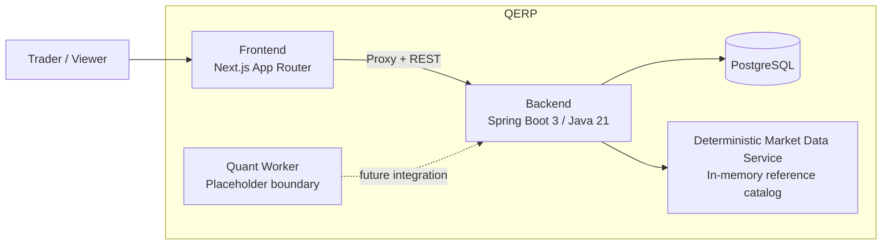
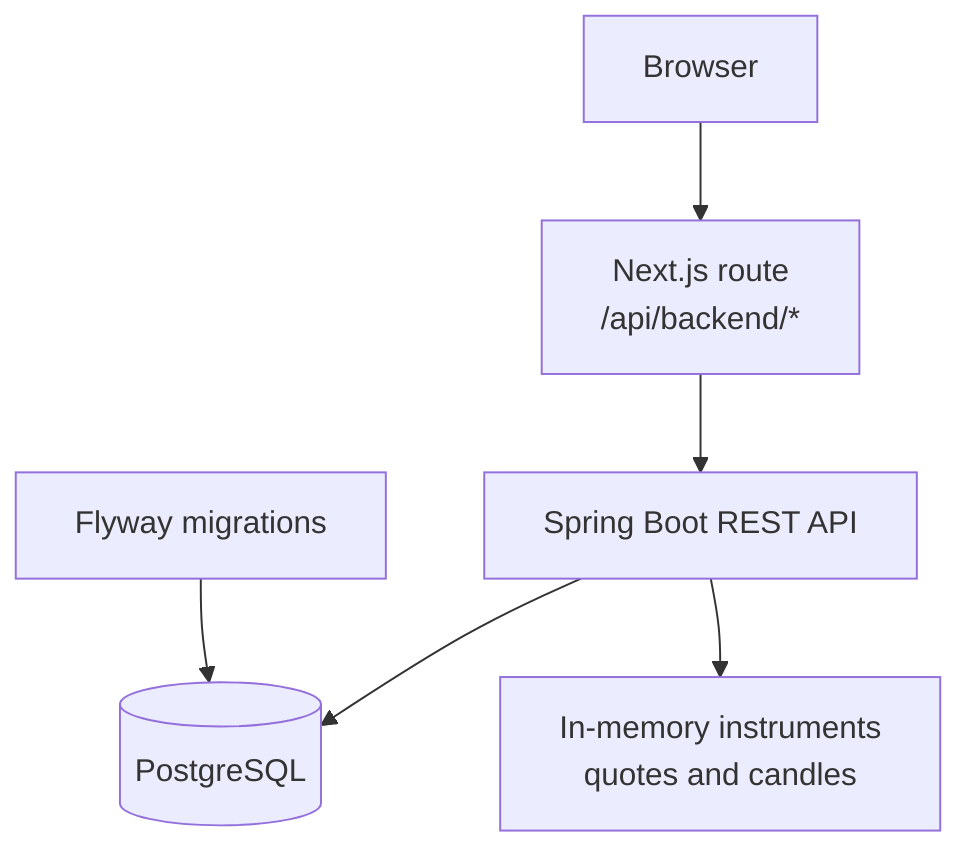

# QERP Architecture

## Overview

QERP is currently organized as a small, deployable paper-trading system with clear boundaries:
- a **Next.js web frontend** for the product experience
- a **Spring Boot backend** as the source of truth for trading and portfolio state
- **PostgreSQL** for persistence
- a **quant-worker placeholder** for future strategy automation

The architecture favors a single understandable runtime over early platform complexity.

## System Context



## Current Runtime Shape



### Why this shape works well today
- The **frontend** stays focused on product presentation and user input.
- The **backend** owns order validation, simulation, and portfolio mutation.
- The **database** persists the minimal paper-trading state needed for continuity.
- The **market-data service** is deterministic, making the current slice easy to reason about and demo.
- The **worker boundary** exists without forcing asynchronous infrastructure before it is needed.

## Component Responsibilities

| Component | Responsibility |
| --- | --- |
| Frontend | Search instruments, show quote/chart panels, submit orders, render portfolio and recent orders |
| Next.js proxy route | Forward browser requests to the backend without requiring direct browser-to-backend coupling |
| Backend API | Validate requests, simulate paper execution, expose read models, persist state |
| Portfolio service | Compute summary metrics and positions from persisted portfolio state plus reference prices |
| Market data service | Serve supported instruments, quote snapshots, and deterministic candle series |
| PostgreSQL | Store orders, shared portfolio state, and open positions |
| Quant worker placeholder | Reserved boundary for future scheduled or event-driven quant workloads |

## Client and API Entry Points

| Entry point | Audience | Current contract |
| --- | --- | --- |
| `/` | End users | Single-page dashboard for search, quote/chart inspection, order entry, portfolio summary, positions, and recent orders |
| `/api/backend/*` | Frontend runtime | Next.js proxy route that forwards browser-originated requests to the backend API |
| `/api/v1/instruments/*` | Frontend proxy or API consumers | Instrument search over the built-in demo market catalog |
| `/api/v1/market/*` | Frontend proxy or API consumers | Deterministic quote and candle data for supported symbols |
| `/api/v1/orders*` | Frontend proxy or API consumers | Paper order submission, listing, lookup, and cancellation |
| `/api/v1/portfolio*` | Frontend proxy or API consumers | Portfolio headline state and current positions |

## Architectural Constraints in the Current Product

These are part of the current public product reality, not hidden implementation details:

- **Single shared paper portfolio:** authentication is not implemented yet, so the runtime behaves like one shared demo account.
- **Deterministic market data:** quote snapshots and candles come from a built-in catalog rather than a live market feed.
- **Synchronous execution flow:** order submission runs validation, execution simulation, persistence, and portfolio mutation in the backend request path.
- **No broker connectivity:** orders never leave the platform and are always simulated.
- **No worker-driven automation:** the quant worker is a documented extension point only.

## Program Structure

### Repository layout

```text
qerp3/
├─ backend/
├─ frontend/
├─ docs/
├─ infra/
└─ quant-worker/
```

### Backend structure

```text
backend/src/main/java/com/qerp/
├─ api/           HTTP controllers and transport models
├─ application/   Services, persistence adapters, market-data access
├─ domain/        Paper-trading and portfolio rules
└─ QerpApplication.java
```

### Frontend structure

```text
frontend/src/
├─ app/           App Router pages and proxy route
├─ components/    Dashboard UI sections
├─ lib/           API client helpers and request guards
└─ types/         Frontend API types
```

## Design Notes for External Readers

### Backend organization
The backend follows a pragmatic layered structure:
- **`api`** translates HTTP requests and responses
- **`application`** coordinates use cases and persistence
- **`domain`** holds the actual paper-trading rules

This makes the order lifecycle and portfolio logic visible without introducing unnecessary framework abstraction.

### Frontend organization
The frontend keeps the dashboard straightforward:
- **`app`** defines runtime entrypoints
- **`components`** map closely to visible product panels
- **`lib`** centralizes backend access and client helpers
- **`types`** keep request/response usage explicit in TypeScript

## Related Docs

- [Runtime lifecycle](runtime-lifecycle.md)
- [Core ERD](erd.md)
- [Current product scope](mvp.md)