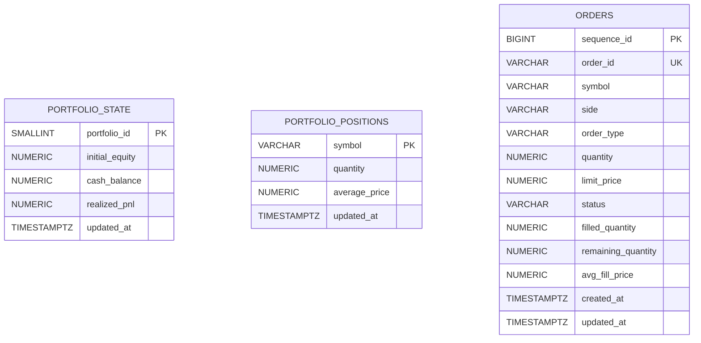

# QERP Core ERD

This ERD reflects the current persisted data model behind the paper-trading product slice.

## Scope

The current schema is intentionally compact:
- one table for **orders**
- one table for **shared portfolio headline state**
- one table for **symbol-level positions**

Authentication, user accounts, broker connectivity, and quant automation tables are not part of the implemented schema yet.

## ER Diagram

## Table Roles

### `portfolio_state`
Stores the current paper account headline metrics that persist across requests.

| Column | Meaning |
| --- | --- |
| `portfolio_id` | Primary key for the shared portfolio state |
| `initial_equity` | Starting paper capital |
| `cash_balance` | Current available cash |
| `realized_pnl` | Realized profit and loss from completed sells |
| `updated_at` | Last portfolio update timestamp |

**Current model note:** the application currently seeds a single portfolio state row with an initial paper balance of `100000.00` USD.

### `portfolio_positions`
Stores the current open position per symbol.

| Column | Meaning |
| --- | --- |
| `symbol` | Position key |
| `quantity` | Current quantity held |
| `average_price` | Weighted average acquisition price |
| `updated_at` | Last position update timestamp |

There is no separate positions history table yet; this table represents the current snapshot only.

### `orders`
Stores paper-trading order records and their lifecycle fields.

| Column | Meaning |
| --- | --- |
| `sequence_id` | Internal primary key for stable ordering |
| `order_id` | Public order identifier |
| `symbol` | Requested instrument symbol |
| `side` | `BUY` or `SELL` |
| `order_type` | `MARKET` or `LIMIT` |
| `quantity` | Requested quantity |
| `limit_price` | Limit price when applicable |
| `status` | Current order state |
| `filled_quantity` | Filled quantity |
| `remaining_quantity` | Remaining quantity |
| `avg_fill_price` | Average execution price when filled |
| `created_at` | Creation timestamp |
| `updated_at` | Last order update timestamp |

## Important Modeling Notes

### Orders and portfolio are coupled in application logic
The current schema does **not** persist explicit foreign keys between `orders`, `portfolio_state`, and `portfolio_positions`. Instead:
- the backend simulates an order
- persists the resulting order state
- updates portfolio headline state and symbol positions in the same backend transaction

That is a deliberate simplification for the current single-portfolio paper-trading slice.

### Portfolio state and positions are conceptually linked, not relationally keyed
`portfolio_state` and `portfolio_positions` together represent one shared paper account in the current runtime.

However, the present schema does **not** store a `portfolio_id` foreign key on `portfolio_positions`. The connection between these tables exists in backend application logic and runtime behavior, not as a persisted relational constraint.

### Market data is not persisted here
Instrument reference data, quote snapshots, and candle series are currently served by a small built-in demo market catalog in memory. They are part of the product experience, but not part of the persisted relational model yet.

### No user model yet
Because authentication is not implemented, there are no `users`, `accounts`, or `portfolios` ownership tables yet. The current runtime behaves like one shared paper account.

## Practical Interpretation

If you are reading the codebase from the outside, the core data story is:
- **orders** record what the user asked the simulator to do
- **portfolio_state** records the current paper account headline balances
- **portfolio_positions** records the open holdings produced by filled trades

That is the full persisted core of QERP today.