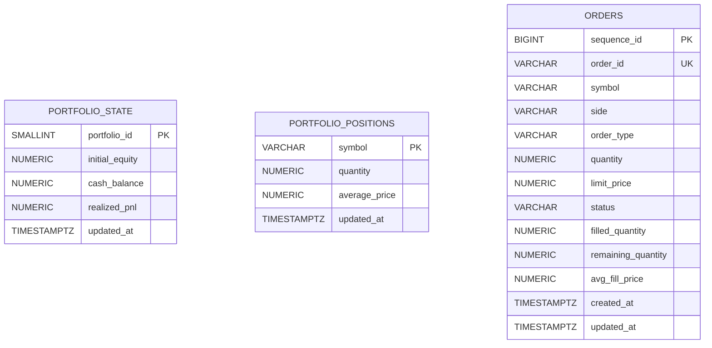

# QERP 핵심 ERD

이 ERD는 현재 페이퍼 트레이딩 제품 범위를 뒷받침하는 영속 데이터 모델을 설명합니다.

## 범위

현재 스키마는 의도적으로 작게 유지되어 있습니다.
- **주문**을 저장하는 테이블 1개
- **공유 포트폴리오 핵심 상태**를 저장하는 테이블 1개
- **심볼별 포지션**을 저장하는 테이블 1개

인증, 사용자 계정, 브로커 연동, 퀀트 자동화 관련 테이블은 아직 구현 범위에 포함되어 있지 않습니다.

## ER 다이어그램

## 테이블 역할

### `portfolio_state`
요청 간 유지되어야 하는 페이퍼 계좌의 핵심 요약 지표를 저장합니다.

| 컬럼 | 의미 |
| --- | --- |
| `portfolio_id` | 공유 포트폴리오 상태의 기본 키 |
| `initial_equity` | 시작 페이퍼 자본금 |
| `cash_balance` | 현재 사용 가능한 현금 |
| `realized_pnl` | 확정된 매도 손익 |
| `updated_at` | 마지막 포트폴리오 갱신 시각 |

**현재 모델 참고:** 애플리케이션은 초기 페이퍼 잔고 `100000.00 USD`를 가진 단일 포트폴리오 행을 사용합니다.

### `portfolio_positions`
심볼별 현재 보유 포지션을 저장합니다.

| 컬럼 | 의미 |
| --- | --- |
| `symbol` | 포지션의 기본 키 |
| `quantity` | 현재 보유 수량 |
| `average_price` | 가중평균 매입 단가 |
| `updated_at` | 마지막 포지션 갱신 시각 |

별도의 포지션 이력 테이블은 아직 없으며, 이 테이블은 현재 스냅샷만 나타냅니다.

### `orders`
페이퍼 주문과 그 생명주기 상태를 저장합니다.

| 컬럼 | 의미 |
| --- | --- |
| `sequence_id` | 안정적인 정렬을 위한 내부 기본 키 |
| `order_id` | 외부에 노출되는 주문 식별자 |
| `symbol` | 요청한 종목 심볼 |
| `side` | `BUY` 또는 `SELL` |
| `order_type` | `MARKET` 또는 `LIMIT` |
| `quantity` | 요청 수량 |
| `limit_price` | 지정가 주문일 때의 가격 |
| `status` | 현재 주문 상태 |
| `filled_quantity` | 체결 수량 |
| `remaining_quantity` | 미체결 수량 |
| `avg_fill_price` | 체결 시 평균 체결가 |
| `created_at` | 생성 시각 |
| `updated_at` | 마지막 갱신 시각 |

## 중요한 모델링 메모

### 주문과 포트폴리오는 애플리케이션 로직으로 연결됩니다
현재 스키마에는 `orders`, `portfolio_state`, `portfolio_positions` 사이의 명시적 외래 키가 없습니다. 대신 백엔드는 다음을 한 트랜잭션 안에서 처리합니다.
- 주문 시뮬레이션
- 결과 주문 상태 저장
- 포트폴리오 핵심 상태와 심볼별 포지션 갱신

이는 현재 단일 포트폴리오 중심의 페이퍼 트레이딩 범위를 단순하게 유지하기 위한 선택입니다.

### 포트폴리오 상태와 포지션은 개념적으로 연결됩니다
`portfolio_state`와 `portfolio_positions`는 함께 하나의 공유 페이퍼 계좌를 나타냅니다.

다만 현재 스키마에는 `portfolio_positions`에 `portfolio_id` 외래 키가 없습니다. 두 테이블의 연결은 데이터베이스 제약이 아니라 백엔드 애플리케이션 로직과 런타임 동작으로 보장됩니다.

### 시장 데이터는 이 ERD에 저장되지 않습니다
종목 기준 정보, 시세 스냅샷, 캔들 시계열은 현재 애플리케이션 메모리에 있는 소규모 데모 카탈로그에서 제공됩니다. 제품 경험의 일부이지만, 아직 관계형 저장 모델에는 포함되지 않습니다.

### 사용자 모델은 아직 없습니다
인증이 구현되지 않았기 때문에 `users`, `accounts`, `portfolios` 같은 소유권 모델 테이블은 아직 존재하지 않습니다. 현재 런타임은 하나의 공유 페이퍼 계좌처럼 동작합니다.

## 실무적으로 해석하면

외부 독자 관점에서 현재 QERP의 핵심 데이터 구조는 다음 세 가지로 이해하면 충분합니다.
- **`orders`**는 사용자가 시뮬레이터에 요청한 주문을 기록합니다.
- **`portfolio_state`**는 현재 페이퍼 계좌의 핵심 잔액 상태를 기록합니다.
- **`portfolio_positions`**는 체결 결과로 생긴 현재 보유 종목을 기록합니다.

이 세 가지가 오늘 기준 QERP의 영속 핵심입니다.
