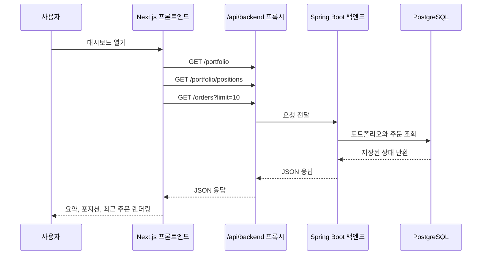
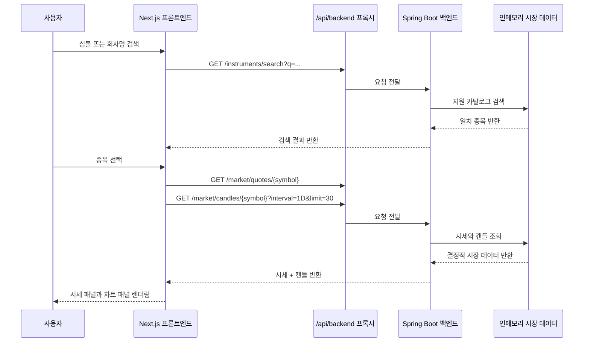
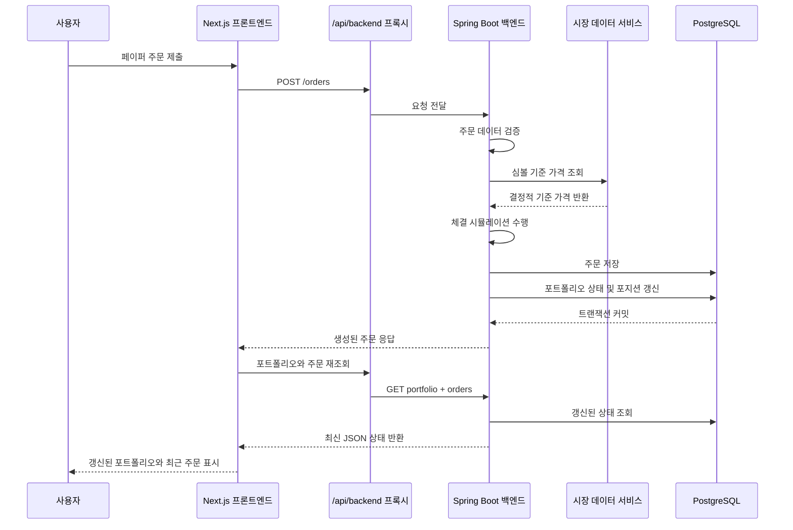
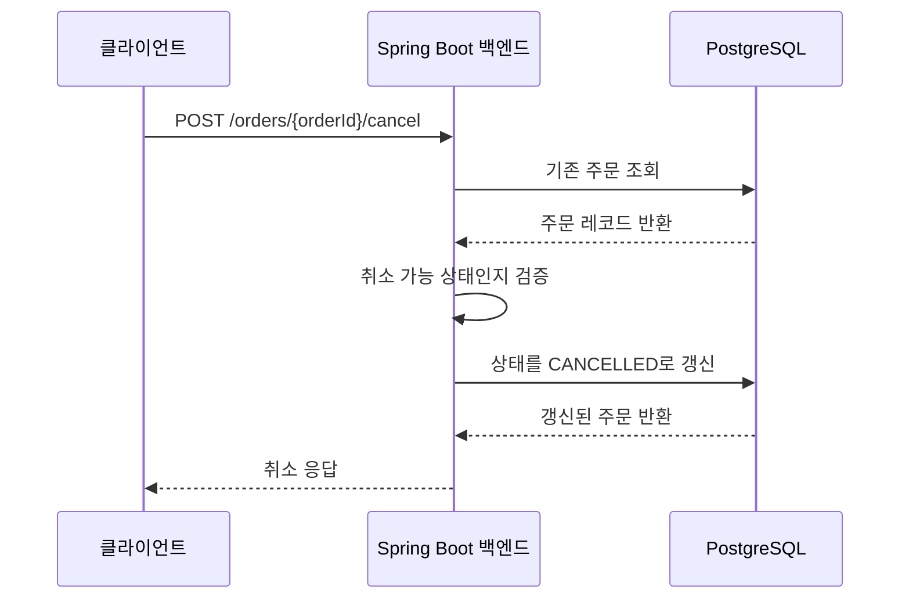

# QERP 런타임 흐름

이 문서는 현재 QERP 런타임이 실제로 어떻게 동작하는지 설명합니다.

## 1. 시작 단계

### 백엔드 시작
1. Spring Boot가 애플리케이션을 시작합니다.
2. Flyway가 주문 및 포트폴리오 관련 스키마를 적용합니다.
3. 백엔드는 포트폴리오, 주문, 종목, 시세, 캔들용 REST 엔드포인트를 노출합니다.
4. 지원 심볼 대상 결정적 시장 데이터 서비스가 메모리에서 준비됩니다.

### 프론트엔드 시작
1. Next.js가 웹 애플리케이션을 시작합니다.
2. 브라우저가 대시보드를 로드합니다.
3. 백엔드 데이터 요청은 프론트엔드 프록시 경로 `/api/backend/*`를 통해 전달됩니다.

## 2. 대시보드 진입 흐름

초기 페이지 로드 시 프론트엔드는 현재 포트폴리오 상태와 최근 주문을 함께 조회합니다.

## 3. 종목 탐색 흐름

현재 시장 탐색 경험은 결정적이며 요청 기반으로 동작합니다.

### 클라이언트가 알아야 할 요청 규칙

현재 공개 API를 평가하거나 연동할 때 유용한 제약은 다음과 같습니다.
- 종목 검색은 비어 있지 않은 `q` 파라미터가 필요하며 `limit`은 `1`부터 `20`까지 허용됩니다.
- 시세 및 캔들 엔드포인트는 지원하지 않는 심볼에 대해 `404 NOT_FOUND`를 반환합니다.
- 캔들 조회는 현재 `1D` 간격만 지원하며 `limit`은 `1`부터 `60`까지 허용됩니다.

## 4. 주문 제출 흐름

주문 생성은 백엔드 요청 경로 안에서 동기적으로 처리됩니다.

### 현재 체결 규칙
- **시장가 주문**은 현재 기준 가격으로 즉시 전량 체결됩니다.
- **지정가 주문**은 제출 시점에 한 번 평가됩니다.
- 지정가 조건을 만족하면 즉시 전량 체결됩니다.
- 조건을 만족하지 않으면 **`PENDING`** 상태로 남습니다.
- 제출 이후 가격 변화에 따라 대기 주문을 다시 채우는 백그라운드 처리나 자동 재평가 루프는 아직 구현되어 있지 않습니다.

## 5. 주문 취소 흐름

대기 중인 주문은 백엔드 API를 통해 취소할 수 있습니다.

## 6. 런타임 단계별 데이터 기준

| 런타임 단계 | 기준 데이터 소스 |
| --- | --- |
| 지원 종목 목록 | 인메모리 시장 데이터 서비스 |
| 시세 스냅샷 | 인메모리 시장 데이터 서비스 |
| 캔들 시계열 | 인메모리 시장 데이터 서비스 |
| 주문 생명주기 | PostgreSQL `orders` 테이블 |
| 포트폴리오 핵심 상태 | PostgreSQL `portfolio_state` 테이블 |
| 현재 포지션 | PostgreSQL `portfolio_positions` 테이블 |

## 7. 현재 의도적으로 제외된 범위

현재 런타임 흐름에는 다음 항목이 포함되지 않습니다.
- 로그인 또는 사용자별 세션
- 외부 브로커 주문 라우팅
- 스트리밍 시장 데이터 구독
- 워커가 유발하는 자동 포지션 변경
- 이후 가격 변화에 따라 `PENDING` 주문을 자동 체결하는 백그라운드 처리

이 제한 덕분에 현재 제품 범위는 작고 결정적이며 이해하기 쉬운 형태를 유지합니다.
