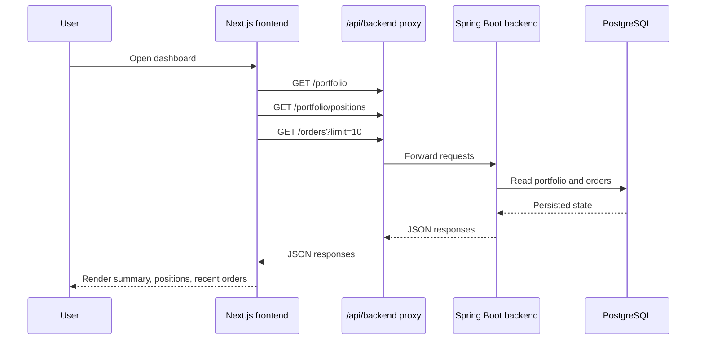
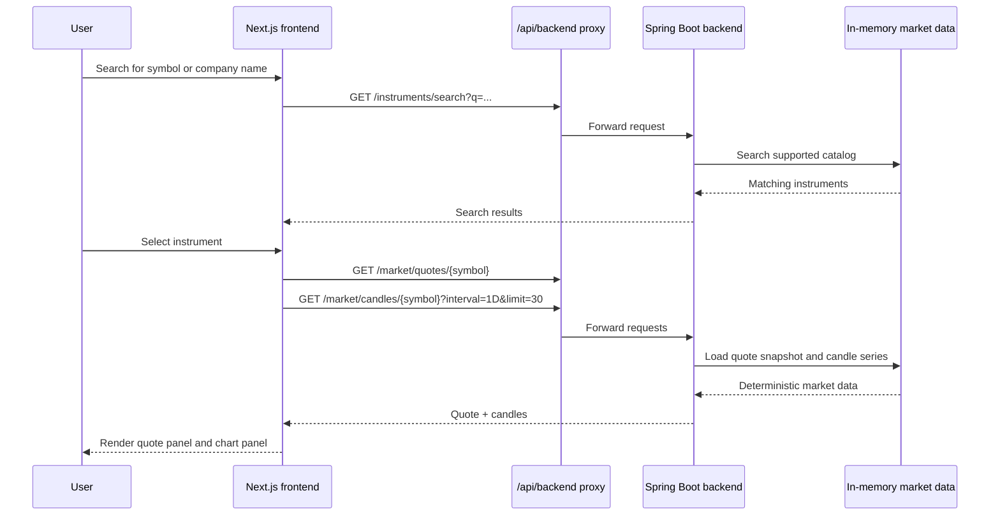
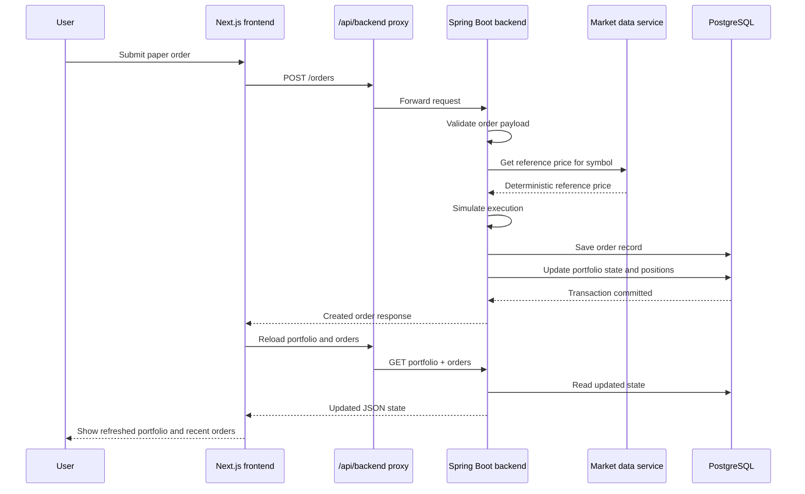
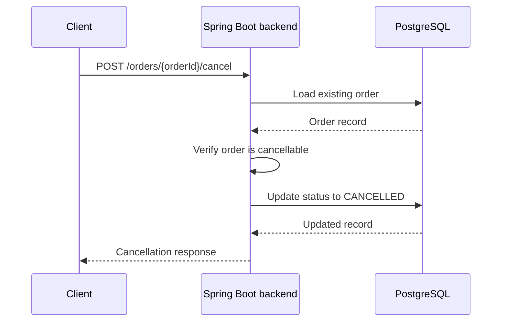

# QERP Runtime Lifecycle

This document describes how the current QERP runtime behaves today.

## 1. Startup Lifecycle

### Backend startup
1. Spring Boot starts the application.
2. Flyway applies the schema migration for orders and portfolio tables.
3. The backend exposes REST endpoints for portfolio, orders, instruments, quotes, and candles.
4. The deterministic market-data service is available in memory for supported symbols.

### Frontend startup
1. Next.js starts the web application.
2. The browser loads the dashboard.
3. Browser requests for backend data go through the frontend proxy route at `/api/backend/*`.

## 2. Dashboard Load Lifecycle

On initial page load, the frontend requests the current portfolio and recent trading state.

## 3. Instrument Discovery Lifecycle

The current market exploration flow is deterministic and request-driven.

### Client-visible request rules

These are useful public constraints for anyone integrating with or evaluating the current API surface:
- instrument search requires a non-blank `q` parameter and currently supports `limit` values from `1` to `20`
- quote and candle endpoints return `404 NOT_FOUND` for unsupported symbols
- candle requests currently support only the `1D` interval and `limit` values from `1` to `60`

## 4. Order Submission Lifecycle

Order placement is handled synchronously inside the backend request path.

### Current execution behavior
- **Market orders** fill immediately at the current reference price.
- **Limit orders** are checked once when they are submitted.
- If a limit order crosses the reference price at submission time, it fills immediately.
- If it does not cross, it remains **`PENDING`**.
- A background market replay or auto-repricing loop is **not** implemented yet.

## 5. Order Cancellation Lifecycle

Pending orders can be cancelled through the backend API.

## 6. Data Ownership by Runtime Stage

| Runtime stage | Source of truth |
| --- | --- |
| Supported instruments | In-memory market-data service |
| Quote snapshot | In-memory market-data service |
| Candle series | In-memory market-data service |
| Order lifecycle | PostgreSQL `orders` table |
| Portfolio headline state | PostgreSQL `portfolio_state` table |
| Open positions | PostgreSQL `portfolio_positions` table |

## 7. What Is Deliberately Missing Today

The current lifecycle does **not** include:
- login or user-specific sessions
- external broker order routing
- streaming market data subscriptions
- automated worker-triggered position changes
- background filling of pending orders based on later price moves

That keeps the present product slice small, deterministic, and easy to understand.